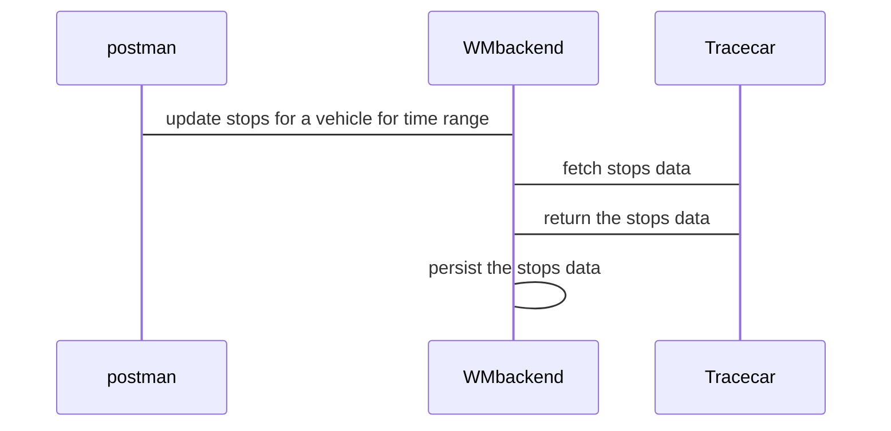

<!-- prettier-ignore -->

```mermaid
sequenceDiagram
    postman -> WMbackend : update stops for a vehicle for time range
    WMbackend -> Tracecar : fetch stops data
    Tracecar -> WMbackend : return the stops data
    WMbackend -> WMbackend : persist the stops data
```

